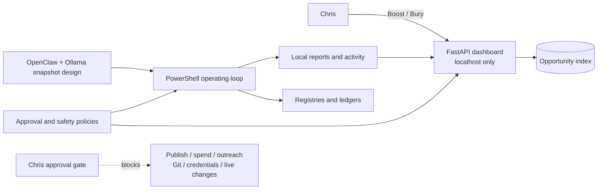

# OpenClawOps

[](https://github.com/cbw29512/openclawops/actions/workflows/showcase-ci.yml)

A local-first supervised automation command center built around a strict rule:

> Prepare work locally. Ask Chris before any external or risky action.

OpenClawOps preserves the policies, dashboard, scripts, local data contracts, review queues, quality gates, and audit structure used by the Nova automation workspace.

## Snapshot status

This repository is a **pre-Windows-reinstall backup from May 2026**. It preserves the system design and local workspace code. It must not be interpreted as proof that the gateway, scheduled tasks, Ollama model, or hourly automation are currently running on a restored machine.

The repository is valuable as:

- a supervised-agent architecture example
- an approval-gated automation workspace
- a local command-center implementation
- a policy and audit design case study
- a recoverable source snapshot

It is not a turnkey autonomous publishing or monetization system.

## Safety boundary

The locked operating model is:

| Capability | Status |
|---|---|
| Read local reports | Allowed |
| Score, deduplicate, and research ideas locally | Allowed |
| Generate local drafts, artifacts, audits, and recommendations | Allowed |
| Boost or Bury local opportunity priority | Allowed |
| Publish or modify live pages | Blocked without Chris approval |
| Sell, perform outreach, or send messages | Blocked without Chris approval |
| Spend money or create accounts | Blocked without Chris approval |
| Use credentials or change affiliate links | Blocked without Chris approval |
| Commit or push code | Blocked without Chris approval |
| Run destructive or external actions | Blocked without Chris approval |

Dashboard v1 may write only to:

```text
data/opportunity_index.json
```

Boost `+1` means “work harder locally.” Bury `-1` means “lower local priority.” Neither action authorizes publication, spending, outreach, Git operations, credentials, or live changes.

## What the workspace contains

### Local command center

The FastAPI dashboard at `dashboard/` provides:

- current cycle and audit status
- work-order visibility
- opportunity queues
- simulation results
- learning patterns
- live activity events
- local Boost/Bury controls
- NothingButA candidate review routes

The documented local address is:

```text
http://127.0.0.1:8788
```

### Operating policies

The `money_scout/` policy pack defines:

- autonomy and escalation
- budget and ROI constraints
- dashboard approval semantics
- learning-loop behavior
- replication safety
- experiment controls
- finder-fee concierge rules

### Local data contracts

The `data/` directory contains registries and policy data for:

- opportunities
- learning
- experiments
- source discovery
- artifacts
- quality thresholds
- public-page cleanliness
- the saved system manifest

### Automation scripts

The `scripts/` directory preserves PowerShell workflows for local cycles, source health, discovery, audits, reports, voting, artifact preparation, simulations, and learning ledgers.

**Repository CI does not execute these scripts.**

## Architecture



See [`docs/ARCHITECTURE.md`](docs/ARCHITECTURE.md) for trust boundaries and data flow.

## Quality and review gates

The saved NothingButA quality policy requires at least:

| Gate | Minimum |
|---|---:|
| Overall quality | 85 |
| SEO | 80 |
| Code | 80 |
| Mobile | 90 |
| Trust | 100 |

Publishing, domain purchases, ads, affiliate links, lead capture, commits, and pushes remain blocked before approval.

Visitor-facing drafts are separately checked for required mobile/UX markers and banned internal workflow language.

## Safe repository validation

The showcase validator checks the saved system contract without running the automation factory:

```powershell
py -3.12 scripts\validate_showcase.py
```

It verifies:

- required policy and dashboard files exist
- `local_only` remains true
- external actions, spending, outreach, and publishing remain false
- approval language still blocks risky actions
- Dashboard v1 remains limited to local opportunity-priority writes
- quality thresholds have not been weakened
- dashboard safety markers remain present

The generated report is:

```text
showcase-validation-report.json
```

GitHub Actions compiles the Python dashboard code, runs this validator, uploads sanitized evidence, and audits dashboard dependencies. It does not run PowerShell scripts, the gateway, Ollama, scheduled tasks, candidate generation, publishing, or Git write actions.

## Run the preserved dashboard locally

The dashboard expects the workspace at the user's home directory:

```text
C:\Users\<username>\OpenClawOps
```

PowerShell:

```powershell
Set-Location C:\Users\<username>\OpenClawOps\dashboard
py -3.12 -m venv .venv
.\.venv\Scripts\Activate.ps1
python -m pip install --upgrade pip
pip install -r requirements.txt
uvicorn app.main:app --host 127.0.0.1 --port 8788 --reload
```

Open:

```text
http://127.0.0.1:8788
```

Running the dashboard does not automatically authorize or enable external actions. Review `APPROVAL_POLICY.md` and `money_scout/AUTONOMY_AND_ESCALATION_POLICY.md` first.

## Repository limitations

- Several paths are Windows-specific.
- The repository contains a saved workspace snapshot, not a clean distributable package.
- Runtime reports and local state may be stale or intentionally excluded.
- The nested NothingButA public-site repository is excluded because it is maintained separately.
- Current scheduled-task and gateway status must be re-verified on the restored machine.
- Remote/public dashboard deployment is not supported by this showcase layer.
- No approval gate should be changed automatically.

## Why this project matters

OpenClawOps demonstrates how I approach automation that could otherwise become unsafe or unmanageable:

- define allowed and blocked actions explicitly
- separate local preparation from external execution
- give the human operator visible queues and controls
- preserve audit, learning, and evidence artifacts
- use quality thresholds before review
- stop and escalate when evidence conflicts or health checks fail
- validate policy drift without running operational automation

These patterns are relevant to AI operations, workflow automation, implementation, technical account management, solutions consulting, governance, and customer-facing AI roles.

## Documentation

- [`docs/CASE_STUDY.md`](docs/CASE_STUDY.md) — recruiter-facing problem, solution, controls, evidence, and value
- [`docs/ARCHITECTURE.md`](docs/ARCHITECTURE.md) — components, data flow, and trust boundaries
- [`SECURITY.md`](SECURITY.md) — private reporting and safe-use policy
- [`APPROVAL_POLICY.md`](APPROVAL_POLICY.md) — top-level action approval requirements
- [`money_scout/AUTONOMY_AND_ESCALATION_POLICY.md`](money_scout/AUTONOMY_AND_ESCALATION_POLICY.md) — local autonomy and escalation rules
- [`money_scout/DASHBOARD_APPROVAL_MODEL.md`](money_scout/DASHBOARD_APPROVAL_MODEL.md) — exact Boost/Bury semantics
- [`showcase/portfolio_manifest.json`](showcase/portfolio_manifest.json) — machine-readable showcase contract
