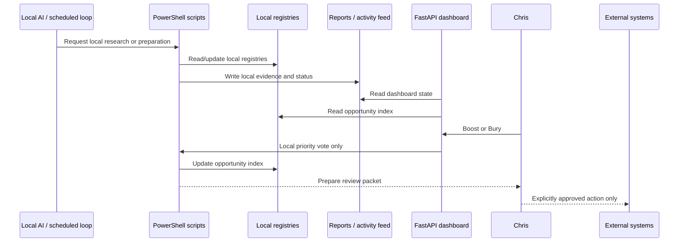

# OpenClawOps Architecture

## Goal

Provide a local operating workspace where AI-assisted research and artifact preparation can run continuously while external, financial, credentialed, destructive, and publishing actions remain under Chris's explicit control.

## Snapshot warning

This repository is a May 2026 pre-reinstall backup. The architecture describes the saved workspace design. Runtime health, scheduled tasks, gateway state, and local model availability must be re-verified on the restored machine.

## Components

### Human approval boundary

Chris is the authority for:

- publishing and selling
- outreach and sending messages
- spending and budget changes
- account creation and credentials
- affiliate-link changes
- commits and pushes
- live production changes
- destructive commands
- external actions

The system may prepare local evidence and recommendations but cannot convert preparation into permission.

### FastAPI dashboard

The local dashboard binds to `127.0.0.1:8788` and renders state from saved reports and registries.

Primary surfaces:

- system and cycle status
- audit counts
- work orders
- simulations
- learning patterns
- opportunity queues
- live observable activity
- NothingButA candidate review
- local Boost/Bury actions

Dashboard v1 may mutate only `data/opportunity_index.json` through the existing local voting script.

### PowerShell operating loop

The saved scripts perform local operations such as:

- cycle coordination
- activity logging
- source health review
- idea discovery and deduplication
- opportunity indexing
- enterprise audits
- artifact preparation
- report generation
- work-order preparation
- simulations
- learning-ledger updates

Repository CI never executes these scripts.

### Local AI layer

The saved design used OpenClaw as the local interaction/gateway layer and Ollama with `llama3:latest` as the configured local model. Current availability is not assumed after the reinstall snapshot.

### Reports and activity

The dashboard reads reports under `reports/`, including current cycle, work orders, source queues, simulations, category research, and live activity events.

Missing or malformed report files fall back to safe empty/error states rather than crashing the entire dashboard.

### Registries and policy data

The `data/` directory contains local memory and control data:

- opportunity index
- learning ledger
- experiment ledger
- source registry and inbox
- artifact registry
- quality policy
- public-page cleanliness policy
- system manifest

### Policy pack

The `money_scout/` policy files define the operating contract for autonomy, escalation, budgets, approvals, learning, experiments, replication, and concierge/finder-fee research.

## Data flow

## Approval semantics

### Boost +1

- raises local priority
- requests more research or artifact improvement
- does not authorize publication, selling, outreach, spending, Git, credentials, or live changes

### Bury -1

- lowers or parks local priority
- preserves the item for deduplication and future evidence
- does not delete important files or external records

## Quality gates

NothingButA candidates are evaluated against saved minimums for overall quality, SEO, code, mobile behavior, and trust. Auto-regeneration may improve local drafts before Chris review, but it cannot unlock external actions.

The public-page policy separates internal workflow language from visitor-facing content. Internal terms are banned from public drafts, while mobile and trust markers remain required.

## Trust boundaries

1. The dashboard is localhost-only.
2. Local reports and registries are trusted workspace inputs but may be stale or malformed.
3. Dashboard actions are limited to local priority changes.
4. The PowerShell scripts are operational code and are not executed by repository CI.
5. Credentials, account sessions, payment methods, and deployment secrets are outside the repository contract.
6. GitHub contains a source snapshot, not authorization to resume scheduled automation.
7. External execution remains a human boundary even when local quality gates pass.

## Failure and escalation behavior

The saved policy requires stop and escalation when:

- enterprise audit fails
- JSON corruption appears
- gateway or task health fails
- evidence conflicts
- an error repeats across cycles
- a script attempts external action without approval
- credentials or spending are required

## Showcase validation

`scripts/validate_showcase.py` performs static validation only:

- checks required files
- checks local-only and disabled-action flags
- checks approval language
- checks Dashboard v1 mutation boundaries
- checks saved quality minimums
- checks dashboard safety markers

It writes a sanitized report and never starts the gateway, model, dashboard, scheduled tasks, PowerShell workflows, or external actions.
